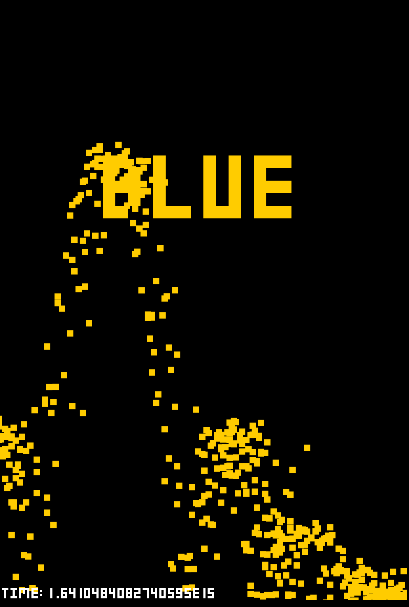
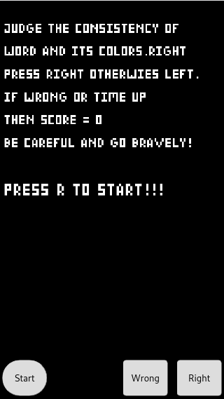

# right
Casual game(休闲小游戏)

## 优化改进 todo
~~0. 基本结构~~

~~0. 音乐~~

~~1. 开始界面~~

~~2. 添加动态效果~~

3. 计数器优化

4. 添加生命数

5. 联网进行数据存储

6. 增加关卡

## Rules
### On PC
Judge the consistency of color and word

if right press right otherwies left

----------------------------------------

### On mobile machine

press the button

----------------------------------------

希望你能获得乐趣

I hope you can have fun.

